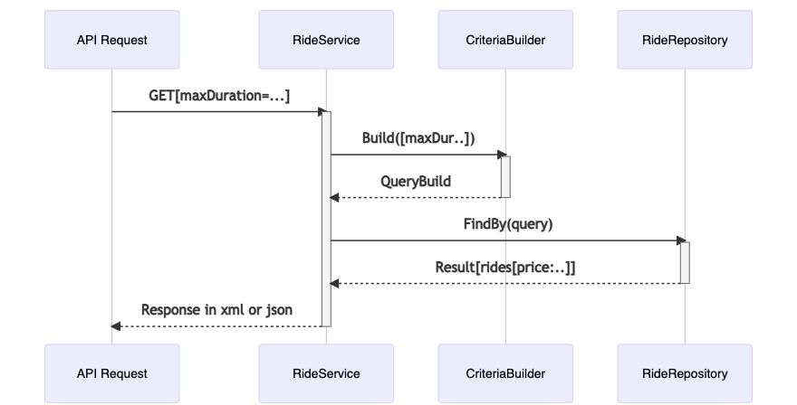

### Sequence diagram


## End point to search in rooms
- A REST API application to list rides

- GET `http://localhost:8001/api/rides`
- Json Response in header `Accept: text/json`
```json
{
  "rides": [
    {
      "id": 1,
      "uuid": "b498b7b9-9073-4a66-b156-fb1abca0dc82",
      "duration": 19,
      "source": "Port Karleeborough",
      "destination": "North Aron",
      "price": 47.42,
      "departureDate": "2021-07-10T04:48:27+00:00",
      "arrivalDate": "2021-07-10T05:07:27+00:00"
    },
    {
      "id": 2,
      "uuid": "e827dc23-f3a6-4007-b023-512a419e16e1",
      "duration": 39,
      "source": "Shanahanhaven",
      "destination": "Josianeburgh",
      "price": 143.67,
      "departureDate": "2021-07-14T02:41:11+00:00",
      "arrivalDate": "2021-07-14T03:20:11+00:00"
    }
  ]
}
```

- GET `http://localhost:8001/api/rides`
- For XML Response send header `Accept: text/xml`
```xml
<?xml version="1.0"?>
<response>
  <rides>
    <id>52</id>
    <uuid>6c50a577-cfe9-4b8e-9bd5-d04ad6f649b1</uuid>
    <duration>6</duration>
    <source>Lake Orville</source>
    <destination>Danielview</destination>
    <price>77.27</price>
    <departureDate>2021-07-04T00:21:12+00:00</departureDate>
    <arrivalDate>2021-07-04T00:27:12+00:00</arrivalDate>
  </rides>
</response>
```

##### Criteria/Filters Examples:
- example `http://localhost:8001/api/rides?sortByDepartureDate=asc&maxPrice=160&minPrice=120`
- minDuration `/api/rides?minDuration=10` requirements=`"\d+"`
- maxDuration `/api/rides?maxDuration=50` requirements=`"\d+"`
- sortByDepartureDate `/api/rides?sortByDepartureDate=desc` requirements=`"[a-z]+"`
- minPrice `/api/rides?minPrice=50` requirements=`"\d+"`
- maxPrice `/api/rides?minPrice=10` requirements=`"\d+"`

### Installation
- Run `make build`

### Running the tests
- Run `make test`

### Built With

* [PHP7.4](http://php.net)
* [Docker](https://www.docker.com/)
* [Symfony5](http://www.symfony.com)
    * Serializer
    * Symfony/phpunit-bridge
    * DataFixture/Seeding
    * Doctrine
